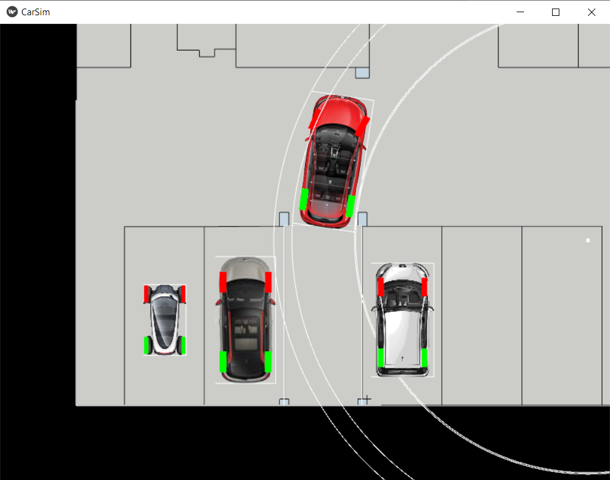

# CarSim

This is a simple parking simulator. It uses the geometry of a few cars
to allow the user to move them realistically around a parking lot, using
the mouse or the keyboard.

## Installation

```bash
$ pip install kivy
$ python CarSim.py
```

## Usage
Click on a car to select it.

Drag with the mouse to move the car. Dragging logitudinally will move the
car, whereas dragging laterally will turn the wheels.
Dragging with the middle mouse button will rotate the car in place.
Dragging with the right mouse button will move the car.

Alternatively, A, S, D, and W can be used to move the car.

